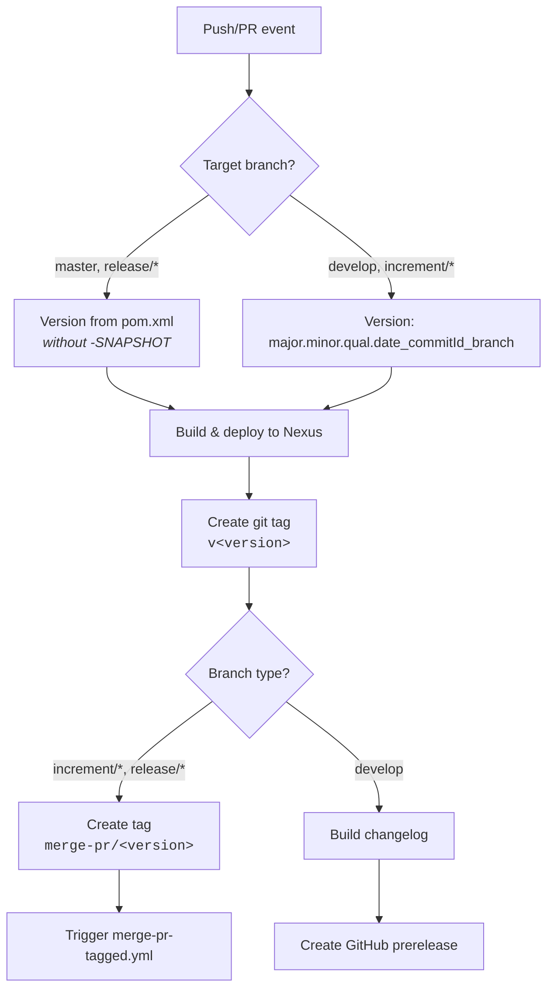
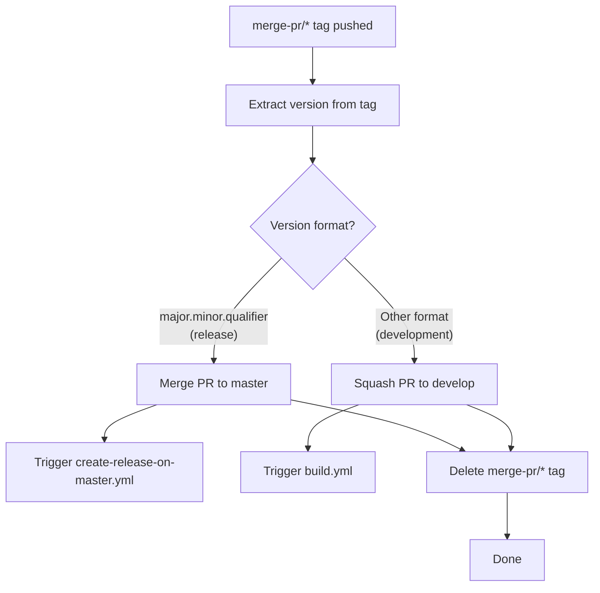
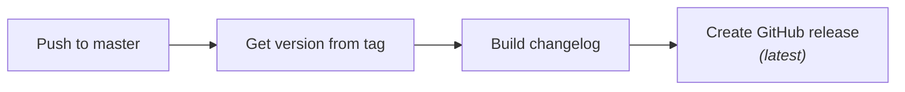
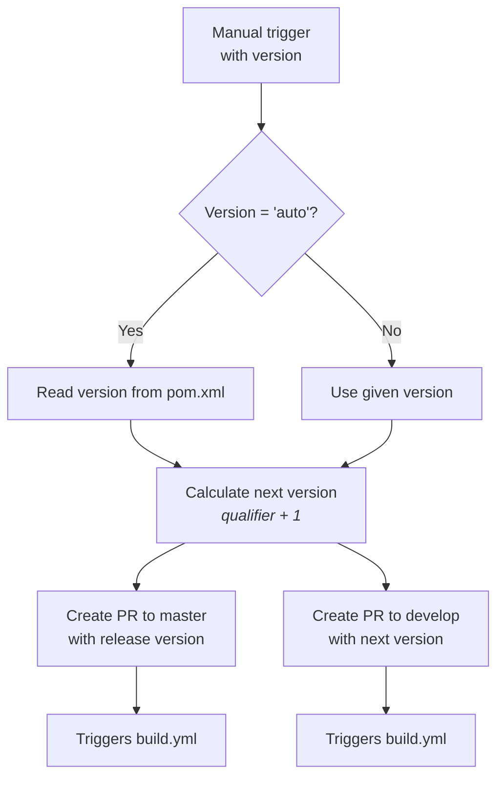
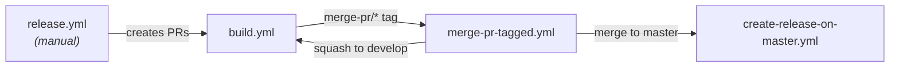

# Development Version and Branch Handling

This document describes the branching strategy, version numbering, and CI/CD pipeline for the judo-meta-jql project.

## Branching Model

The project follows [GitFlow](https://www.atlassian.com/git/tutorials/comparing-workflows/gitflow-workflow). All branches serve a specific purpose in the development lifecycle:

| Branch Pattern | Base Branch | Purpose |
|---------------|-------------|---------|
| `develop` | — | Main development branch with latest sources of the active version |
| `feature/JNG-xxx_summary` | `develop` | New features for the next release |
| `release/x.y.z` or `x_y_betaN` | `develop` | Stabilization before a release (the `release/` prefix is reserved for CI) |
| `bugfix/JNG-xxx_summary` | release branch | Fixes applied during release testing; must also be merged to newer versions |
| `support/JNG-xxx_summary` | release branch | Minor changes for a previous release |
| `hotfix/JNG-xxx_summary` | `master` | Urgent fixes applied to both release and master |
| `master` | — | Latest released (stable) sources |

```mermaid
gitGraph
    commit id: "initial"
    branch develop
    commit id: "dev-1"
    branch feature/JNG-1
    commit id: "feat-1"
    commit id: "feat-2"
    checkout develop
    merge feature/JNG-1 id: "merge-feat"
    branch release/1.0-beta1
    commit id: "rc-1"
    branch bugfix/JNG-4
    commit id: "fix-1"
    checkout release/1.0-beta1
    merge bugfix/JNG-4 id: "merge-fix"
    checkout develop
    merge release/1.0-beta1 id: "merge-release"
    checkout master
    merge release/1.0-beta1 id: "v1.0"
```

## Version Numbers

Version numbers follow semantic versioning with these rules:

| Event | Version Change |
|-------|---------------|
| Starting a `feature/` branch | No change |
| Starting a release branch from `develop` | 2nd number incremented on `develop` |
| Starting a `bugfix/` branch | No change (applied during pre-release testing) |
| Starting a `support/` branch | 3rd number incremented |
| Starting a `hotfix/` branch | 4th number incremented |

## CI/CD Pipeline

The project uses GitHub Actions with four interconnected workflows. Each workflow triggers automatically based on branch events or tags.

### build.yml — Main Build Pipeline

Triggers on pushes to `develop` and pull requests targeting `develop`, `master`, `increment/*`, or `release/*`.



### merge-pr-tagged.yml — Pull Request Merge Handler

Triggers when a `merge-pr/*` tag is pushed. Routes the merge based on version format.



### create-release-on-master.yml — Release Publisher

Triggers on pushes to `master`. Creates the final GitHub release.



### release.yml — Manual Release Trigger

Manually triggered with a version parameter (`auto` or a specific `major.minor.qualifier`).



### Overall Workflow Interaction



## Development Rules

> **Important:** There is no commit without a ticket number. Every pull request and commit must include `JNG-xxx` in the message.

Issue tracking: [JIRA Dashboard](https://blackbelt.atlassian.net/jira/dashboards)
