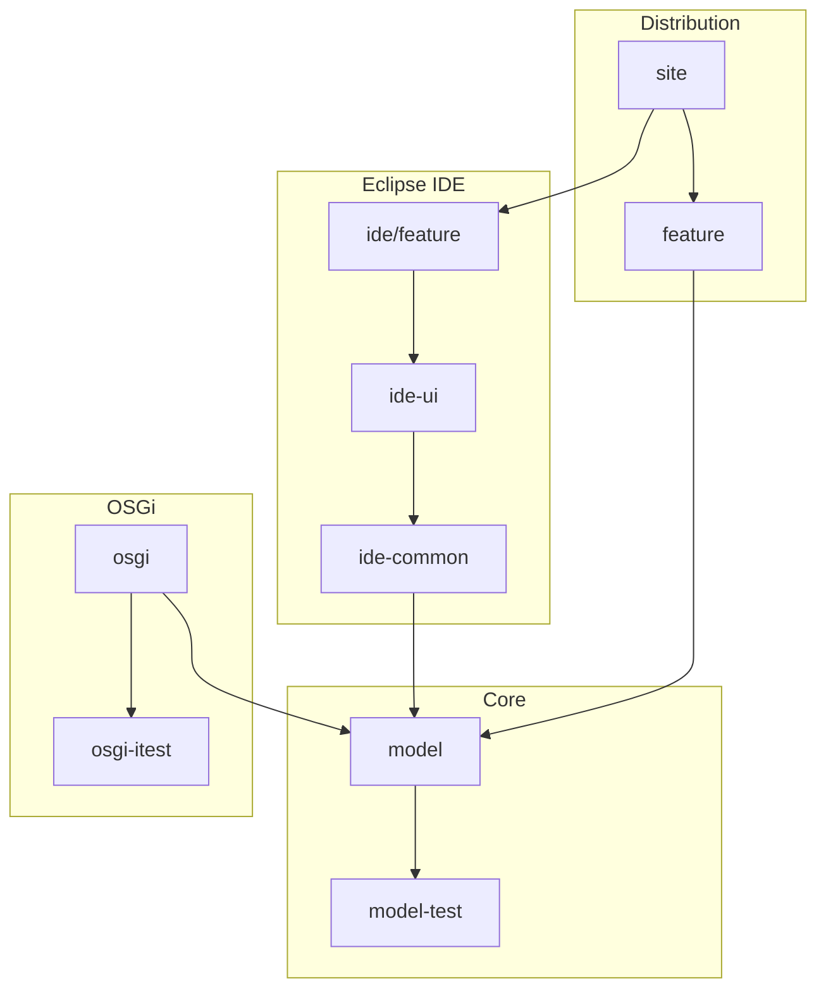

# Contributing to JUDO

## Development Environment Setup

Your development environment must comply with the requirements in the parent project's [CONTRIBUTING guide](https://github.com/BlackBeltTechnology/judo-community/blob/develop/CONTRIBUTING.adoc).

**Required:**
- Java 21 JDK
- Maven 3.9.4+ (or use the included `./mvnw` wrapper)
- For Eclipse IDE work: m2e and Modeling Tools plugins

## Project Structure

This project uses Maven with Tycho for Eclipse plugin packaging. Modules are organized into three groups:

### Model Modules (Core DSL)

| Module | Purpose |
|--------|---------|
| `model/` | Eclipse plugin containing the Xtext grammar (`JqlDsl.xtext`), EMF Ecore model, and generated Java classes. Builders and helpers are generated via MWE2 workflow. |
| `model-test/` | JUnit 5 tests for the parser, grammar validation, and model loading. |

### OSGi Modules

| Module | Purpose |
|--------|---------|
| `osgi/` | Repackages the model as an OSGi bundle with additional services for use in transformation pipelines on non-Eclipse platforms. |
| `osgi-itest/` | Integration tests using Pax Exam with Apache Karaf to verify the OSGi bundle loads and functions correctly. |

### Eclipse IDE Modules

| Module | Purpose |
|--------|---------|
| `feature/` | Eclipse feature — allows installation as an Eclipse feature. |
| `site/` | Eclipse P2 update site. All built versions are compiled as update sites with version-specific URLs. |
| `ide/` | Parent for IDE language support, containing two sub-modules: |
| `ide/ide-common/` | Language Server Protocol (LSP) support for JQL. |
| `ide/ui/` | Eclipse editor integration — content assist, outline, labels, quick fixes. |



## Build Commands

```bash
# Full build (all modules)
./mvnw clean install

# Run tests only
./mvnw clean test

# Run model tests only
./mvnw clean test -pl model-test

# Run a single test class
./mvnw clean test -pl model-test -Dtest=JqlDslParserTest

# Update Eclipse site category versions
./mvnw clean install -P update-category-versions -f site/pom.xml
```

## Working with Eclipse

### Plugin Installation

Install the plugin via P2 sites: go to **Install new software** and add the URL of the update site listed on GitHub, or point to the uncompressed ZIP folder. The plugin includes the metamodel and default editor UI.

### Code Generation

To run code generation inside Eclipse, execute the MWE2 Workflow:

```
hu.blackbelt.judo.meta.jql.model project → src/workflow/generateModel.mwe2
```

Required Eclipse features:
- XTend
- XText
- MWE / MWE2

> **Note:** Files under `model/src/main/xtext-gen/` and `ide/*/xtend-gen/` are generated — do not edit them manually.

## Version Policy

Maven and Eclipse have different version conventions. While Maven uses `SNAPSHOT` versions (e.g., `1.0.0-SNAPSHOT`), Eclipse uses `.qualifier` (e.g., `1.0.0.qualifier`). The Tycho Versions Plugin bridges this gap by replacing the qualifier with proper version numbers during each build.

Semantic versioning rules:
- **Do not** change version numbers when starting `feature/` branches
- The 2nd version number on `develop` is incremented when a release branch is created
- **Do not** change version numbers on `bugfix/` branches
- The 3rd version number on `support/` branches is incremented when started
- The 4th version number on `hotfix/` branches is incremented when started

## Troubleshooting

### JUnit Tests in Eclipse

There is a known issue with Eclipse and Tycho where the classpath does not contain JUnit. A `Required-Bundle` entry has been added to the OSGi Manifest as a workaround. See [Eclipse Bug 534587](https://bugs.eclipse.org/bugs/show_bug.cgi?id=534587).

### Lombok

Tycho does not support Lombok generation directly ([lombok#285](https://github.com/rzwitserloot/lombok/issues/285)). No Lombok is used in the Eclipse plugin modules — all source code in those modules is generated.

### Tycho Repository References

Tycho 1.4.0 and below does not handle repository references inside site definitions, so all referenced plugin sites must be added manually. See [Eclipse Bug 453708](https://bugs.eclipse.org/bugs/show_bug.cgi?id=453708).

## Submitting Issues

Before submitting, please search the issue tracker first. When filing a bug report, include:
- Output of `java -version`, `mvn -version`
- `pom.xml` or `.flattened-pom.xml` (when applicable)
- A minimal reproduction case

File new issues via the [issue form](https://github.com/BlackBeltTechnology/judo-meta-psm-jql/issues/new/choose).

## Submitting Pull Requests

This project follows [GitHub's standard forking model](https://guides.github.com/activities/forking/). Please fork the project to submit pull requests.
