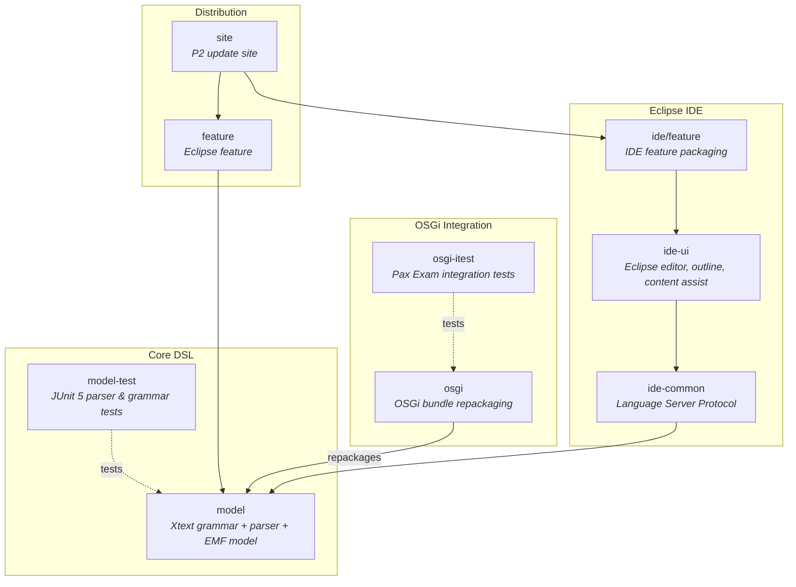
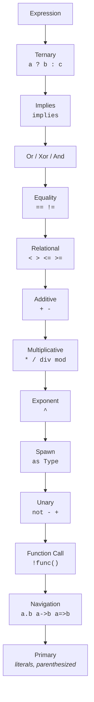

# judo-meta-jql

[](https://github.com/BlackBeltTechnology/judo-meta-psm-jql/actions/workflows/build.yml)

## Introduction

**JQL (JUDO Query Language)** is a general-purpose, declarative query language that lets modelers describe queries without requiring manual implementation by developers. The JUDO architecture handles processing and execution of these queries automatically.

This project contains the **JQL metamodel** — an Xtext-based DSL that defines the grammar, parser, AST (Abstract Syntax Tree), and supporting tooling for JQL expressions. It can be used in three ways:

1. **As an Eclipse plugin** with features and update sites for IDE integration
2. **Standalone** via the `JqlParser` Java API
3. **In OSGi environments** (with or without Eclipse) via the repackaged OSGi bundle

## Architecture

The project is organized as a multi-module Maven build with Tycho for Eclipse plugin packaging. The modules form three layers: the core DSL, OSGi integration, and Eclipse IDE support.



## JQL Expression Language

JQL supports a rich expression syntax with proper operator precedence. The grammar is defined in `model/src/main/java/hu/blackbelt/judo/meta/jql/JqlDsl.xtext`.



**Supported literal types:**

| Type | Syntax | Examples |
|------|--------|---------|
| Boolean | `true`, `false` | `true` |
| Integer | digits | `42` |
| Decimal | digits.digits | `3.14` |
| String | `"..."` or `'...'` | `"hello"` |
| Date | `` `YYYY-MM-DD` `` | `` `2024-01-15` `` |
| Timestamp | `` `YYYY-MM-DDThh:mm:ss` `` | `` `2024-01-15T10:30:00Z` `` |
| Time | `` `hh:mm:ss` `` | `` `10:30:00` `` |
| Measured | number `[unit]` | `5 [kg]`, `100 [m]` |

**Navigation operators:**

| Operator | Meaning |
|----------|---------|
| `.` | Standard property access |
| `->` | Collection navigation |
| `=>` | Container navigation |

## Key API

The main entry point for programmatic use is `JqlParser`:

```java
JqlParser parser = new JqlParser();

// Parse from string
JqlExpression expr = parser.parseString("self.quantity * self.unitPrice * (1 - self.discount)");

// Parse from file
JqlExpression expr = parser.parseFile(new File("query.jql"));

// Parse from stream
JqlExpression expr = parser.parseStream(inputStream);
```

## Build

Requires **Java 21** and **Maven 3.9.4+**. Use the Maven wrapper for consistent builds:

```bash
./mvnw clean install          # Full build
./mvnw clean test             # Run tests only
./mvnw clean test -pl model-test   # Run model tests only
```

## Context

This project is a building block of the [judo-community](https://github.com/BlackBeltTechnology/judo-community) aggregator project. See the corresponding documentation for how this module fits into the JUDO ecosystem.

## Contributing

Everyone is welcome to contribute to JUDO! Please read the [CONTRIBUTING](CONTRIBUTING.md) guide for details.

## License

This project is licensed under the [Eclipse Public License - v 2.0](https://www.eclipse.org/legal/epl-2.0/).
